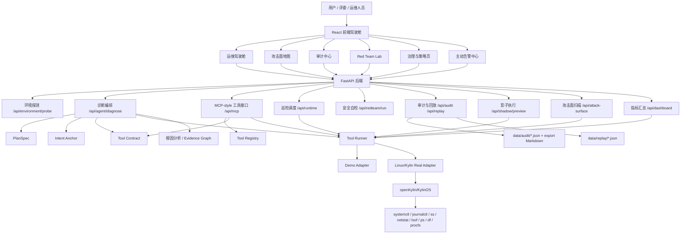

# KylinSafeOps 当前项目状态

本文档基于当前代码仓库整理，用于冻结功能范围、明确真实能力与 Demo 边界，并指导后续 openKylin 实机验收。

## 1. 项目架构图

### 架构说明

- 前端是单页 React 应用，包含驾驶舱、攻击面地图、审计中心、Red Team、治理页、状态页等视图。
- 后端是 FastAPI 服务，负责环境探测、诊断编排、工具调用、安全校验、审计落库和报告导出。
- 工具执行层分为 `demo` 和 `real` 两种适配器：
  - Windows 本地默认走 `demo-adapter`。
  - openKylin/KylinOS 且工具链满足条件时走 `kylin-real-adapter` 或 `linux-real-adapter`。
- 当前 MCP 能力是 MCP-style / MCP-compatible JSON-RPC，不是独立 stdio/SSE MCP server。

## 2. 前端页面与对应 API 关系

| 前端页面 / 区域 | 对应 API | 当前状态 | 说明 |
| --- | --- | --- | --- |
| 运维驾驶舱首页 | `/api/dashboard/summary` | 已连接真实 API | 返回环境、模式、健康分、指标来源等。 |
| 运维驾驶舱首页 | `/api/dashboard/metrics` | 已连接真实 API | real 模式读取 `/proc/stat`、`/proc/meminfo`、`df -h`；demo 模式返回样例指标。 |
| Agent 诊断输入 | `/api/agent/diagnose` | 已连接真实 API | 生成 PlanSpec、工具轨迹、证据图、根因、审计和回放。 |
| 诊断后回放 | `/api/replay/{replay_id}` | 已连接真实 API | 读取 `data/replay` 文件。 |
| 诊断后审计 | `/api/audit/{audit_id}` | 已连接真实 API | 读取 `data/audit` 文件。 |
| 审计中心列表 | `/api/audit?limit=30` | 已连接真实 API | 真实审计会话会进入列表；页面仍保留静态默认历史。 |
| 审计报告导出 | `/api/audit/{audit_id}/export` | 已连接真实 API | 导出 Markdown 报告，已声明 UTF-8。 |
| 攻击面地图 | `/api/attack-surface` | 已连接真实 API | real 模式解析 `ss -lntp`；demo 模式返回样例端口。 |
| 攻击面端口联动诊断 | `/api/agent/diagnose` | 已连接真实 API | 以 `attack_surface_port` 作为诊断来源。 |
| 主动告警中心 | `/api/runtime/alerts` | 已连接真实 API | demo 模式返回样例事件；real 模式调用真实工具巡检。 |
| 手动巡检 | `/api/runtime/scan` | 已连接真实 API | 触发一次后端巡检。 |
| 告警状态更新 | `/api/runtime/alerts/{event_id}/status` | 已连接真实 API | 将告警标记为诊断中、已诊断等。 |
| 影子执行面板 | `/api/shadow/preview` | 已连接真实 API | 只做影响预览和确认要求，不执行真实重启。 |
| Red Team Lab | `/api/redteam/run` | 已连接真实 API | 运行本地安全策略自检并生成审计。 |
| 治理与策略页环境探测 | `/api/environment/probe` | 已连接真实 API | 展示 OS、工具链、模式、DeepSeek 配置状态。 |
| MCP 工具列表 | `/api/mcp/tools/list` | 已实现 API，前端未形成独立完整页面 | 可用于答辩接口演示。 |
| MCP 工具调用 | `/api/mcp/tools/call`、`/api/mcp` | 已实现 API，前端未形成独立完整页面 | 支持 REST 和 JSON-RPC 风格调用。 |
| 认知图谱页 | 无完整后端 API | 主要 Demo/静态展示 | 视觉和概念展示为主。 |
| 假设推理页 | 无完整后端 API | 主要 Demo/静态展示 | 使用前端静态候选根因、反事实卡片。 |
| 策略治理编辑器 | 部分使用 `/api/environment/probe` | 半静态展示 | 编辑器、参数、策略开关未真正下发到后端。 |

## 3. 已实现功能清单

### 后端能力

- FastAPI 服务启动与健康检查。
- 环境探测：
  - `SAFEOPS_MODE=demo|real|auto`
  - OS 类型识别
  - Kylin/openKylin 识别
  - systemd 检测
  - `systemctl`、`journalctl`、`ss`、`netstat`、`lsof`、`ps`、`df` 工具可用性检测
- Tool Contract：
  - 工具白名单
  - 参数范围校验
  - 服务白名单
  - 敏感路径与命令拼接模式拦截
  - 副作用操作标记
- Tool Registry：
  - 工具描述
  - input schema
  - risk
  - side effect
  - shadow execution / human confirm 标记
- MCP-style 工具接口：
  - `/api/mcp/tools/list`
  - `/api/mcp/tools/call`
  - `/api/mcp` JSON-RPC 兼容入口
- 诊断编排：
  - PlanSpec 生成
  - Intent Anchor 校验
  - 工具调用
  - Knowledge State 生成
  - 多候选根因评分
  - Evidence Graph 生成
  - Root Cause 输出
  - rule-fallback Critic
- 工具适配器：
  - demo 模式样例数据
  - real 模式调用 `systemctl`、`journalctl`、`ss`、`netstat`、`lsof`、`ps`、`df`
  - real 模式读取 `/proc/stat`、`/proc/meminfo`
- 审计与回放：
  - 审计 JSON 落库
  - 回放 JSON 落库
  - 审计列表
  - 单条审计读取
  - Markdown 审计报告导出
- Red Team 安全自检：
  - prompt injection
  - command injection
  - tool abuse
  - sensitive path
  - privileged service
  - intent drift
  - log prompt injection
  - output poisoning
- Runtime 巡检：
  - 后台 scheduler
  - 手动 scan
  - 告警列表
  - 告警状态更新
  - 告警联动诊断来源模型
- 影子执行：
  - restart service 前置检查
  - 影响范围说明
  - 回滚建议
  - 人工确认标记
- 攻击面扫描：
  - demo 攻击面快照
  - real 模式基于 `ss -lntp` 解析监听端口
- Dashboard 指标：
  - 环境摘要
  - CPU / 内存 / 磁盘指标
  - demo/real 指标来源标记
- JSON 响应头已统一补充 `charset=utf-8`。

### 前端能力

- 运维驾驶舱主界面。
- Agent 诊断输入和结果展示。
- PlanSpec 展示。
- Tool Trace 展示。
- Evidence Graph / 数字孪生视觉展示。
- Root Cause 和候选根因展示。
- Shadow Execution 展示。
- Audit Report 展示与导出。
- Audit Center 审计中心。
- Red Team Lab 展示和执行。
- Attack Surface 攻击面地图。
- Runtime Alert 主动告警中心。
- Governance/Settings 环境探测与策略展示。
- 移动端和桌面端布局适配。

## 4. Demo 功能清单

### 明确 Demo 数据

- 前端默认诊断数据：`DEMO_DIAGNOSIS`。
- 前端默认回放数据：`DEMO_REPLAY`。
- 前端默认审计数据：`DEMO_AUDIT`。
- 前端默认 Red Team 数据：`DEMO_RED_TEAM`。
- 前端默认影子执行数据：`DEMO_SHADOW_PREVIEW`。
- 审计中心默认历史会话：`auditSessions`。
- 认知图谱页的大部分节点、指标、时间线。
- 假设推理页的大部分候选根因和反事实模拟。
- 状态监控页中的服务表、趋势、事件样例。
- 策略治理页中的策略文本、参数滑块、模型选择、开关状态。
- 攻击面地图在后端数据不足时补齐的端口样例。

### 后端 Demo Adapter

- Windows 本地或 real 条件不足时，`SAFEOPS_MODE=auto` 会进入 demo。
- demo 模式下：
  - `systemctl_status` 返回 nginx failed 样例。
  - `journalctl_unit` 返回 Address already in use 样例。
  - `ss_listen` / `netstat_listen` / `lsof_port` 返回 PID 1234/httpd 样例。
  - `ps_process` 返回 httpd 样例。
  - `cpu_stat`、`memory_info`、`disk_usage` 返回固定资源样例。
  - runtime alerts 返回固定告警样例。
  - attack surface 返回固定端口样例。

### 半真实 / 半 Demo 功能

- Dashboard 指标：API 真实存在，但 Windows/demo 下指标是样例。
- Runtime 主动告警：调度框架真实存在，但 Windows/demo 下事件是样例。
- Attack Surface：API 真实存在，但 Windows/demo 下端口是样例。
- Shadow Execution：API 真实存在，但只做预览，不执行真实处置。
- DeepSeek Critic：接口逻辑存在，默认走 rule-fallback。

## 5. openKylin 必须验证功能清单

### 环境与工具链

- `cat /etc/os-release` 能证明 openKylin/KylinOS。
- `/api/environment/probe` 返回：
  - `is_linux=true`
  - `is_kylin_like=true`
  - `has_systemd=true`
  - `effective_mode=real`
  - `adapter=kylin-real-adapter`
  - `real_mode_ready=true`
- 工具可用性为 true：
  - `systemctl`
  - `journalctl`
  - `ps`
  - `df`
  - `ss` 或 `netstat` 或 `lsof` 至少具备网络上下文能力

### 脚本验收

- 执行并保存：
  - `bash scripts/kylin_preflight.sh`
  - `bash scripts/kylin_immutable_verify.sh`
- 生成并保存：
  - `data/kylin_preflight_report.md`
  - `data/kylin_immutable_verify_report.md`

### 后端 real 模式

- 启动：
  - `SAFEOPS_MODE=real bash scripts/start_backend_kylin.sh`
- 验证：
  - `/health`
  - `/api/environment/probe`
  - `/api/dashboard/summary`
  - `/api/dashboard/metrics`
  - `/api/agent/diagnose`
  - `/api/mcp/tools/list`
  - `/api/mcp/tools/call`

### 真实工具轨迹

必须在 Tool Trace 或录屏中看到真实命令：

- `systemctl status nginx.service --no-pager`
- `journalctl -u nginx.service -n ... --no-pager`
- `ss -lntp`
- `netstat -lntp`
- `lsof -nP -iTCP:80 -sTCP:LISTEN`
- `ps -p ... -o pid,user,comm,args`
- `df -h /`
- `/proc/stat`
- `/proc/meminfo`

### 真实故障场景

- 制造 nginx/apache 80 端口冲突。
- 诊断结果必须显示：
  - PlanSpec
  - Tool Trace
  - journalctl 证据
  - ss/netstat/lsof 证据
  - ps 进程归属
  - Evidence Graph
  - Root Cause
  - Audit ID
  - Replay ID

### 安全与权限验收

- 证明 Agent 以非 root 或受限账户运行。
- 证明自动诊断只执行只读工具。
- 证明 `restart_service` 未授权时被拦截。
- 证明 Shadow Execution 只预览影响，不直接修改配置或重启服务。
- 证明关键配置文件不会在未授权情况下被修改。

### 前端验收截图

- openKylin 环境探测结果。
- real adapter 模式。
- 真实诊断工具轨迹。
- Red Team 自检结果。
- MCP tools/list 和 tools/call。
- 审计中心真实会话。
- 审计报告导出 Markdown。

## 6. 当前技术债务清单

### 产品边界债务

- 前端默认加载大量 Demo 数据，容易让评委误判真实能力边界。
- 静态历史审计和真实审计混在审计中心，需要更明显标记。
- 部分页面视觉完整，但业务闭环不足。

### 架构债务

- 当前 MCP 是兼容式 HTTP/JSON-RPC 接口，不是独立标准 MCP server。
- Tool Registry 和 Tool Contract 仍是 Python 常量，规则库未外部化。
- 诊断场景主要围绕 nginx/端口冲突，覆盖面还不够广。
- Runtime scheduler 是进程内内存状态，未持久化事件队列。
- 审计和回放使用本地 JSON 文件，未接数据库或索引。

### 安全债务

- 最小权限主要靠工具白名单和策略门禁，还缺系统级沙箱证明。
- 受限账户、sudoers、capability、文件权限策略未固化为部署脚本。
- 副作用操作只做到预览和拦截，未实现受控执行、回滚和执行后验证。
- Red Team 用例数量有限，尚未形成完整安全规则库。

### openKylin 验收债务

- 缺 openKylin/KylinOS 实机录屏。
- 缺 real adapter 下真实命令输出样本归档。
- 缺 immutable 系统下完整无安装验证路径的最终证明。
- 缺非 root 运行截图。
- 缺真实 nginx 故障场景的完整审计报告样本。

### 前端债务

- `App.tsx` 文件过大，页面、数据转换、Demo 数据、工具函数混在一起。
- 很多组件依赖全局 Demo 常量，真实数据为空时自动回退样例，容易掩盖接口问题。
- MCP 能力没有独立页面，只能通过 API 或间接展示证明。
- 页面中部分按钮只改变前端状态，没有后端效果。

### 测试债务

- 缺后端单元测试。
- 缺 API smoke test 脚本。
- 缺前端 e2e 测试。
- 缺 openKylin 实机验收自动化脚本汇总。
- 缺 CI 流程。

### 文档债务

- 部分历史文档在 PowerShell 下曾出现编码显示问题，需要最终统一检查。
- 需要答辩版“真实能力 / Demo 能力 / 待验收能力”说明页。
- 需要 openKylin 实机验收截图清单和录屏脚本。

## 当前结论

当前仓库已经具备完整的 Windows 本地演示闭环：

- 环境探测
- 诊断编排
- 工具契约
- MCP-style 工具接口
- Red Team 自检
- 审计落库
- 报告导出
- 前端驾驶舱展示

但一等奖级别提交还必须补齐 openKylin/KylinOS 实机证据，并把 Demo 边界明确标注。当前阶段应停止新增功能，优先完成实机验证、截图录屏、报告样本和答辩材料固化。
